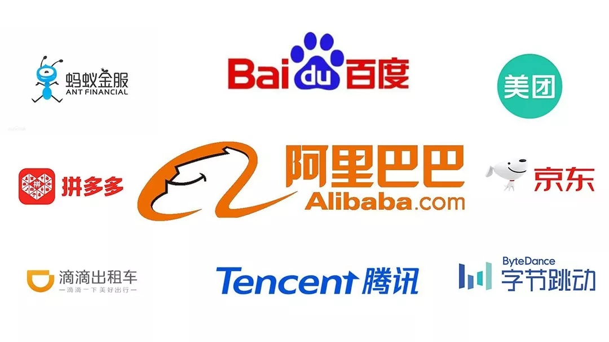

# 国内互联网大厂/科技公司及其项目Github主页、技术团队主页

学习企业级的开源优秀框架或工具也是一种自我提升的方式，特此收录。公司排名不分先后，不定期更新，欢迎补充:)

## 1. 阿里巴巴

- [Alibaba (github.com)](https://github.com/alibaba)
- [OceanBase (github.com)](https://github.com/oceanbase)
- 阿里技术（公众号）
- 阿里巴巴中间件（公众号）

## 2. 腾讯

- [Tencent (github.com)](https://github.com/Tencent)
- [腾讯 AlloyTeam (github.com)](https://github.com/AlloyTeam)

## 3. PingCAP

- [PingCAP (github.com)](https://github.com/pingcap)

## 4. 字节跳动

- [Bytedance Inc. (github.com)](https://github.com/bytedance)
- 字节跳动技术团队（公众号）

## 5. 美团

- [美团 Meituan (github.com)](https://github.com/meituan)

- [美团点评 (github.com)](https://github.com/Meituan-Dianping)

- [美团技术团队（公众号同名）](https://tech.meituan.com/)

## 6. 百度

- [Baidu (github.com)](https://github.com/baidu)

- [PaddlePaddle (github.com)](https://github.com/PaddlePaddle)

## 7. 京东

- [JD (github.com)](https://github.com/jd-opensource)

## 8. 华为

- [HUAWEI (github.com)](https://github.com/Huawei)

## 9. 滴滴

- [DiDi (github.com)](https://github.com/didi)
- 滴滴技术（公众号）

## 10. b站

- [bilibili (github.com)](https://github.com/bilibili)

## 11. 蚂蚁

- [OpenSPG (github.com)](https://github.com/OpenSPG/openspg)

## 12. 小米

- [小米信息部技术团队](https://xiaomi-info.github.io/)

## 13. 伴鱼

- [伴鱼技术团队](https://tech.ipalfish.com/blog/)

